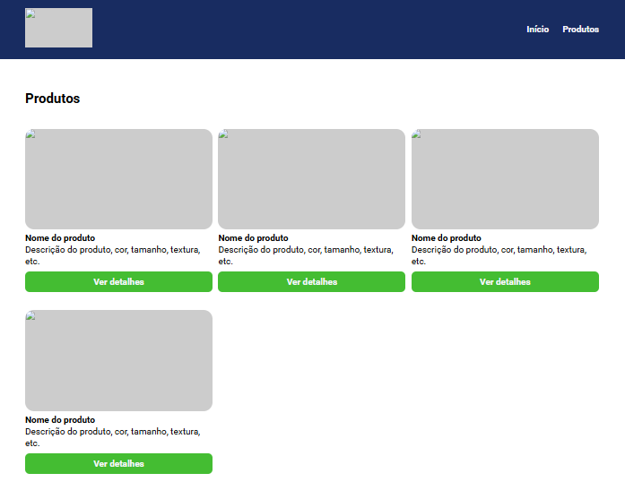

## Projeto 03: Site Lanchonete da Renata

### Requisitos da atividade:

1) Converter o CSS do projeto disponibilizado na área "Material de apoio" para o SASS;
2) Utilizar as variáveis do SASS;
3) Utilizar os módulos do SASS;
4) Criar uma branch chamada exercicio_sass no repositório do curso;
5) Armazenar os arquivos SASS nesta branch e enviar o link do repositório através da plataforma.

### Sobre a atividade:

- Foi facíl de fazer as mudanças do código CSS para um novo código utilizando SASS, com SASS fica muito pratico fazer a estilização da página. Com a estrutura do código em SASS toda compreensão fica mais simples de seguir com a estilização.

##

Clique para ver 👇

    <a href="">
        </img>
    </a>

